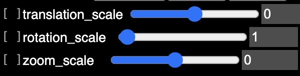

# Interactive registration

It is possible to manually transform a neuroglancer layer using `ngtools`.

## Interactive shifts

The active layer can be transformed using predefined key presses.
We define the following shortcuts:

| Key | Action name | Description |
| --- | ----------- | ----------- |
| ++ctrl+i++ | `rotate-layer-x+` | Rotate about the <font color="red">**x**</font> axis, clockwise |
| ++ctrl+j++ | `rotate-layer-y+` | Rotate about the <font color="green">**y**</font> axis, clockwise |
| ++ctrl+k++ | `rotate-layer-z+` | Rotate about the <font color="blue">**z**</font> axis, clockwise |
| ++ctrl+alt+i++ | `rotate-layer-x-` | Rotate about the <font color="red">**x**</font> axis, anticlockwise |
| ++ctrl+alt+j++ | `rotate-layer-y-` | Rotate about the <font color="green">**y**</font> axis, anticlockwise |
| ++ctrl+alt+k++ | `rotate-layer-z-` | Rotate about the <font color="blue">**z**</font> axis, anticlockwise |
| ++i++ | `translate-layer-x+` | Translate along the <font color="red">**x**</font> axis, positively |
| ++j++ | `translate-layer-y+` | Translate along the <font color="green">**y**</font> axis, positively |
| ++k++ | `translate-layer-z+` | Translate along the <font color="blue">**z**</font> axis, positively |
| ++i++ | `translate-layer-x-` | Translate along the <font color="red">**x**</font> axis, negatively |
| ++j++ | `translate-layer-y-` | Translate along the <font color="green">**y**</font> axis, negatively |
| ++k++ | `translate-layer-z-` | Translate along the <font color="blue">**z**</font> axis, negatively |
| ++ctrl+shift+i++ | `zoom-layer-x+` | Zoom along the <font color="red">**x**</font> axis |
| ++ctrl+shift+j++ | `zoom-layer-y+` | Zoom along the <font color="green">**y**</font> axis |
| ++ctrl+shift+k++ | `zoom-layer-z+` | Zoom along the <font color="blue">**z**</font> axis |
| ++ctrl+shift+l++ | `zoom-layer-all+` | Zoom along **all** axes |
| ++alt+shift+i++ | `zoom-layer-x-` | Unzoom along the <font color="red">**x**</font> axis |
| ++alt+shift+j++ | `zoom-layer-y-` | Unzoom along the <font color="green">**y**</font> axis |
| ++alt+shift+k++ | `zoom-layer-z-` | Unzoom along the <font color="blue">**z**</font> axis |
| ++alt+shift+l++ | `zoom-layer-all-` | Unzoom along **all** axes |

As soon as one of these actions is triggered, three sliders are defined in the
shader of the active layer. These sliders allow the scale of each type of
action (translation, rotation or zoom) to be tuned. These sliders are defined
via

```text
#uicontrol float translation_scale slider(min=-5, max=5, default=0, step=0.01)
#uicontrol float rotation_scale slider(min=0, max=90, default=1, step=0.1)
#uicontrol float zoom_scale slider(min=-5, max=5, default=0, step=0.01)
```

and look like this:



* The rotation slider defines the number of degrees applied by one key press.
* Translation are expressed in terms of "model space units", which are
  usually defined by the output dimensions of the topmost layer. These units
  are scaled by `2 ** translation_scale`. Therefore, when
  `translation_scale == 0`, each key press applies a translation of one
  model unit; when `translation_scale == 1`, each key press applies a
  translation of two model units; and when `translation_scale == -1`, each
  key press applies a translation half a model unit.
* The zoom slider defines the numbers of powers of two (or one over two)
  applied by each zoom or unzzom key press. When `zoom_scale == 0`,
  each key press zooms by a factor `2` (or unzoom by a factor 0.5); when
  `zoom_scale == 1`, each key press zooms by a factor `4`; and when
  `zoom_scale == -1`, each key press zooms by a factor `sqrt(2)`.

## Cursor-based translation

The shortcut ++ctrl+t++ applies a translation that brings the location
pointed by the mouse cursor to the location of the crosshair.
This action is named `translate-layer-mouse-to-crosshair`.

## Landmark-based registration

It is also possible to apply a translation, rigid body transformation,
similtude or affine transform that minimizes the distance between
two (paired) point clouds. The point clouds can be defined (or reset)
using the following shortcuts:

| Key | Action name | Description |
| --- | ----------- | ----------- |
| ++ctrl+m++ | `add-moving-landmark` | Add a landmark attached to the moving image |
| ++ctrl+f++ | `add-fixed-landmark` | Add a landmark attached to the fixed image |
| ++alt+m++ | `pop-moving-landmark` | Remove the last moving landmark |
| ++alt+f++ | `pop-fixed-landmark` | Remove the last fixed landmark |

These actions automatically create two annotation layers named
`::landmarks::fixed` and `::landmarks::moving`. These layers can be
deleted after use, or if one wishes to clear existing landmarks.

!!! warning
    The correspondence between the fixed and moving landmarks is defined
    by the order in which they are defined.

Once the two pointclouds are defined, a transformation can be fitted
and applied using any of these shortcuts:

| Key | Action name | Description |
| --- | ----------- | ----------- |
| ++alt+t++ | `translate-layer-landmarks` | Fit and apply a translation |
| ++alt+r++ | `rigid-transform-layer-landmarks` | Fit and apply a rigid body transform |
| ++alt+s++ | `similitude-transform-layer-landmarks` | Fit and apply a similitude |
| ++alt+a++ | `affine-transform-layer-landmarks` | Fit and apply an affine transform |

The moving point cloud also gets transformed, and can then be augmented
with additional landmarks and re-used.
